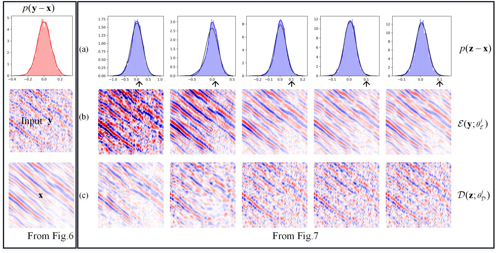

# 2023 TGRS Attenuation of Seismic Random Noise With Unknown Distribution: A Gaussianization Framework

This repo contains the official implementation for the paper [Attenuation of Seismic Random Noise With Unknown Distribution:A Gaussianization Framework](https://ieeexplore.ieee.org/document/10193802)
by Chuangji Meng, Jinghuai Gao∗, Yajun Tian, Liang Zhao, Haoqi Zhao, Zhiqiang Wang.

SRNGF couples the Gaussianization subproblem and Gaussian denoising subproblem based on the plug-and
play (PaP) framework. The Gaussianization submodule with learnable parameters maps seismic data with the noise of
unknown distribution to the one corrupted by Gaussian noise. The learnable parameters can be updated through unsupervised
online training according to the noise of the unknown distribution on a single field data. The Gaussian denoising submodule, which
can be replaced by seismic denoiser, aims only for Gaussian noise removal, making SRNGF incorporate the denoiser prior
to seismic data. SRNGF can improve the ability of non-DL/DL denoiser to suppress field noise by mapping unknown field noise
to the Gaussian noise. 

This is an example of using SRNGF($\widetilde{\mathbb{F}} , \widetilde{\mathbb{G}}$) to transform non-Gaussian/field noise into Gaussian noise in latent space.

Synthetic Noise Example

Field noise example

### Running 
SRNGF($\widetilde{\mathbb{F}} , \widetilde{\mathbb{G}}$), when the Gaussian denoising operator $\widetilde{\mathbb{G}}$ is a (trained) deep learning model. 
In the .\model_zoo folder, we have provided some pretrained Checkpoints of deep models for implementing $\widetilde{\mathbb{G}}$  

```bash
python GVAE-deep*.py 
```
SRNGF($\widetilde{\mathbb{F}} , \widetilde{\mathbb{G}}$), when the Gaussian denoising operator $\widetilde{\mathbb{G}}$ is a non deep learning method.
In the .\seispro folder, we have provided some reproducible non-deep methods for implementing $\widetilde{\mathbb{G}}$  


**Note**:
----------------------------------------------------------------------------------------
***You can easily integrate your own (non-deep learning/deep learning) algorithms into SRNGF to further improve the ability to suppress unknown distribution noise.***

This is an example of incorporating a deep model ([VI-non-IID](https://github.com/mengchuangji/VI-Non-IID)) into SRNGF. The first to third rows are the denoising results, the removed noise, and the local similarity map, respectively. The second column is the result of VI-non-IID, and the third to seventh columns are the corresponding SRNGF results.


## Acknowledgement

This repo is largely based on the [UDN](https://github.com/zhengdihan/Unsupervised_denoising)  repo and [VI-non-IID](https://github.com/mengchuangji/VI-Non-IID) repo, and uses some reproducible non-deep methods and seismic_utils from [Yangkang Chen](https://github.com/chenyk1990). Thanks for their contributions.


## References

If you find the code/idea useful for your research, please consider citing

```bib
@ARTICLE{meng2023attenuation,
  author={Meng, Chuangji and Gao, Jinghuai and Tian, Yajun and Zhao, Liang and Zhao, Haoqi and Wang, Zhiqiang},
  journal={IEEE Transactions on Geoscience and Remote Sensing}, 
  title={Attenuation of Seismic Random Noise With Unknown Distribution: A Gaussianization Framework}, 
  year={2023},
  volume={61},
  number={},
  pages={1-15},
  keywords={Noise reduction;Gaussian noise;Feature extraction;Attenuation;Probability density function;Noise measurement;Training;Deep learning (DL);gaussianization;plug-and-play (PaP);random noise attenuation;unknown distribution;unsupervised},
  doi={10.1109/TGRS.2023.3298679}}
```
and/or our earlier work VI-non-IID, which can be incorporated into SRNGF as a blind Gaussian denoiser.

```bib
@ARTICLE{meng2022seismic,
  author={Meng, Chuangji and Gao, Jinghuai and Tian, Yajun and Wang, Zhiqiang},
  journal={IEEE Transactions on Geoscience and Remote Sensing}, 
  title={Seismic Random Noise Attenuation Based on Non-IID Pixel-Wise Gaussian Noise Modeling}, 
  year={2022},
  volume={60},
  number={},
  pages={1-16},
  keywords={Attenuation;Noise measurement;Gaussian noise;Data models;Noise reduction;Noise level;Training;Deep learning (DL);noise estimation;noise modeling;non-independently identically distribution (IID);seismic random noise attenuation (NA);variational inference (VI)},
  doi={10.1109/TGRS.2022.3175535}}
```

## Contact
If you have any problem about our code, feel free to contact 4120105144@stu.edu.xjtu.cn, 2279767412@qq.com or describe your problem in Issues
